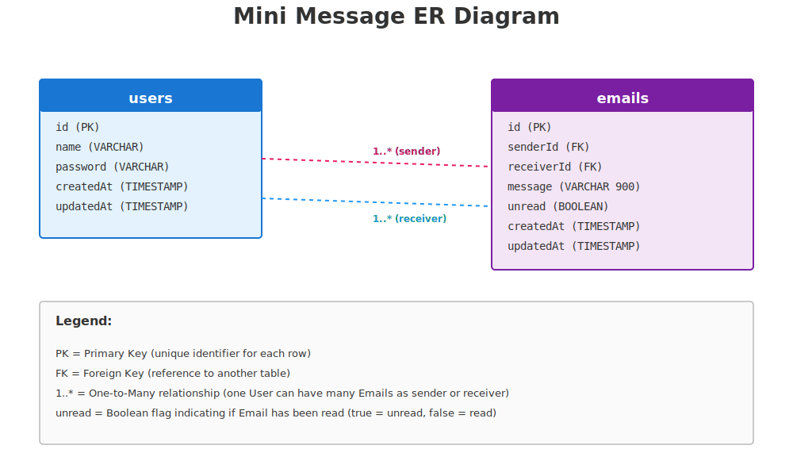

# Mini Message

Full-stack mini messenger with Express/Sequelize backend, React/Vite frontend, and Socket.IO for live email notifications.

## Project Overview
Mini Message is a full-stack mini-messaging application where users can register, log in, change password, send/read/delete messages ("emails"), and receive real-time notifications via Socket.IO. The UI is built with Vite, the backend with Express, and data persistence uses MySQL (SQLite in tests).

### Technology Choices and Rationale
- **Express 5 + MVC**: familiar and lightweight Node framework; separates route/controller/service/repo responsibilities.
- **Sequelize (ORM)**: faster development than raw SQL; built-in validation and relationships.
- **Repository layer**: decouples data access, makes unit tests easier (mockable).
- **Socket.IO**: event-driven notifications, room-based targeting (user_<id>).
- **React + Vite**: fast dev server with HMR; React Router 7 for view management.

## Features
- Register, login, change password
- Send, read, and delete messages ("emails")
- Socket.IO notifications on new incoming email
- LAN-friendly: API listens on 0.0.0.0; Vite host mode for testing in local network

## Tech Stack
- Backend: Node.js, Express 5, Sequelize, MySQL (SQLite in tests), Socket.IO
- Frontend: React 19 + Vite, React Router 7, socket.io-client
- Tests: Jest + Supertest (server)

## Prerequisites
- Node.js 18+
- MySQL server running and reachable
- PowerShell 5+ (for the provided commands on Windows)

## Configuration
### Server
Database config is in `server/util/db.js`:
- Default dev DB: database `messenger`, user `root`, password `qwerty`, host `localhost`
- Tests run in memory SQLite when `NODE_ENV=test`
Adjust credentials/host or switch to env-driven config as needed.

Optional: set `ALLOWED_ORIGINS` (comma-separated) for Socket.IO CORS; defaults to `*`.

Example server configuration (PowerShell env or `.env` equivalent):
```
# API port (server/index.js uses 3000 by default; change code or set PORT if you add support)
$env:PORT='3000'

# Database (match these to your MySQL instance)
$env:DB_NAME='messenger'
$env:DB_USER='root'
$env:DB_PASS='qwerty'
$env:DB_HOST='localhost'

# Socket.IO allowed origins (comma-separated). Use '*' for dev, restrict in prod.
$env:ALLOWED_ORIGINS='http://localhost:5173,http://1.1.1.1:5173'

# Jest/test mode uses NODE_ENV=test and sqlite in-memory
$env:NODE_ENV='development'
```
If you prefer a `.env` file, place these keys in `server/.env` and load them (e.g., with `dotenv`) or update `server/util/db.js` to read from `process.env`.

### Client (Vite)
Env files live in `client/`:
- `.env` (baseline), `.env.development` (local), `.env.host` (LAN testing)
- Required keys:
  - `VITE_API_URL` (e.g., `http://localhost:3000` or `http://<lan-ip>:3000`)
  - `VITE_SOCKET_URL` (optional; defaults to `VITE_API_URL` if unset)

Examples:
```
# client/.env.development
VITE_API_URL=http://localhost:3000
VITE_SOCKET_URL=http://localhost:3000

# client/.env.host 
# Replace <lan-ip> with your machine's LAN IP (e.g., 192.168.x.x)
VITE_API_URL=http://<lan-ip>:3000
VITE_SOCKET_URL=http://<lan-ip>:3000
```
After editing env files, restart Vite.

## Installation
From repo root:
```powershell
# install server deps
cd server
npm install

# install client deps
cd ../client
npm install
```

## Running
### Backend (API + Socket.IO)
```powershell
cd server
npm start   # nodemon index.js (listens on http://0.0.0.0:3000)
```

### Frontend
- Local dev:
```powershell
cd client
npm run dev
```
- Host mode for local network testing (uses `.env.host`):
```powershell
cd client
npm run dev:host
```
Open the URL Vite prints (e.g., http://localhost:5173 or http://<lan-ip>:5173).

## Testing (server)
```powershell
cd server
npm test   # uses sqlite in-memory
```

### Test Strategy
- **Unit**: services/repository layers (mocked data access). Examples: `tests/unit`.
- **Integration**: HTTP API + DB (SQLite in-memory). Examples: `tests/integration`, `tests/api`.
- **Run**: `npm test` (sets `NODE_ENV=test`, uses SQLite in-memory DB).

## Data Model
- Core tables: `users` (id, name, password), `emails` (id, senderId, receiverId, message, unread, createdAt/updatedAt).
- Relationships: User 1..* Email (senderId) and User 1..* Email (receiverId).
- **ER Diagram**: see `docs/er-diagram.svg` for visual relationship overview.



## API Overview
Base URL defaults to `http://localhost:3000`.

**User**
- `POST /register` – body `{ name, password }`
- `POST /login` – body `{ name, password }`
- `PUT /change-password` – body `{ userId, newPassword }` (oldPassword optional)
- `GET /user/:name` – lookup user by name

**Email**
- `POST /emails` – body `{ senderId, receiverId, message }`
- `GET /emails/inbox/:userId`
- `GET /emails/sent/:userId`
- `PUT /emails/:id/read` – body `{ userId }`
- `DELETE /emails/:id` – body `{ userId }`
- `GET /emails/:id`

### API Description / Example Bodies
| Endpoint | Method | Description | Example |
| --- | --- | --- | --- |
| `/register` | POST | Create user | `{ "name": "alice", "password": "secret123" }` |
| `/login` | POST | Login | `{ "name": "alice", "password": "secret123" }` |
| `/change-password` | PUT | Change password | `{ "userId": 1, "newPassword": "newpass123" }` |
| `/user/:name` | GET | Lookup user by name | n/a |
| `/emails` | POST | Send message | `{ "senderId":1, "receiverId":2, "message":"hi" }` |
| `/emails/inbox/:userId` | GET | Inbox | n/a |
| `/emails/sent/:userId` | GET | Sent | n/a |
| `/emails/:id/read` | PUT | Mark read | `{ "userId":1 }` |
| `/emails/:id` | DELETE | Delete message | `{ "userId":1 }` |


## Realtime (Socket.IO)
- Client connects with `VITE_SOCKET_URL` (or `VITE_API_URL`).
- Emits `join` with `userId` to join room `user_<id>`.
- Server emits `new_email` to `user_<receiverId>` when an email is created.

## Common Issues
- **DB auth fails**: update credentials in `server/util/db.js` or supply env-driven config.
- **CORS/Socket origin**: set `ALLOWED_ORIGINS` on the server if you need to restrict origins.
- **LAN testing**: set `VITE_API_URL`/`VITE_SOCKET_URL` in `.env.host` to your machine LAN IP and run `npm run dev:host`.

## Project Structure
```
client/   # React + Vite frontend
server/   # Express + Sequelize + Socket.IO backend
```

## Roles and Work Distribution
- Paan and Aleksander had a part in everything.

## License
ISC (see package.json)
